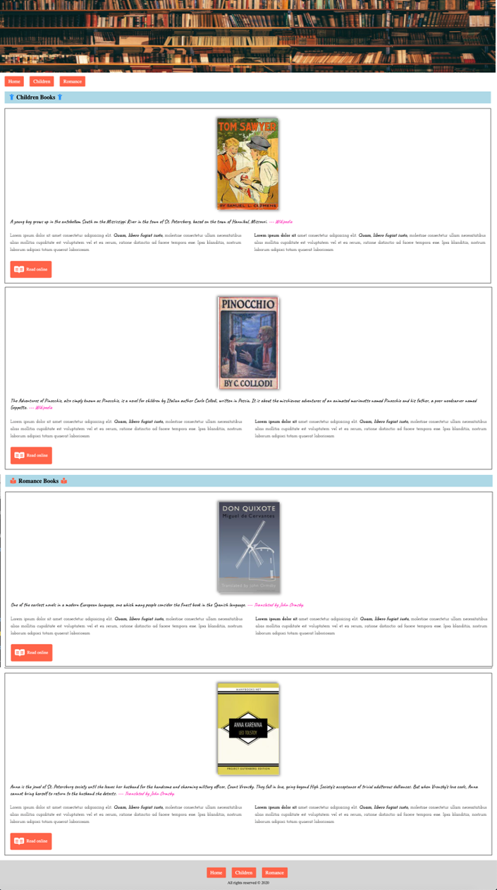

# UIB_Typography_Exercise-1

Single webpage about online book reading

## Instructions

- Don't forget to add favicon in head of document.
- From Google Fonts import "Josefin Slab" with weights 400, 600, 700 in this document, and use for \
 tags
- From Google Fonts import "Caveat" with weights 400, 700 in this document, and use for bloquotes
- Add a title to the document
- Use External CSS to style the document
- Link should be opened in a new Tab
- Please just code what you see, neither less nor more.

## The desktop overview

## The online version

In order to see live version, just [click...!](https://hsnakk.github.io/UIB_Typography_Exercise-1/)
